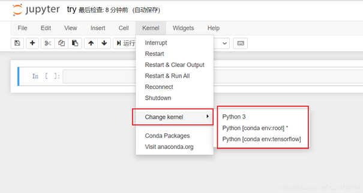

- 从cmd启动jupyter
```shell
!conda install jupyter notebook
!jupyter notebook
```
- Jupyter Notebook使用指定的conda环境
 ```
 !conda install nb_conda
 ```
 

 ### vscode有用的插件
 - paste image 
可以在markdown文本中快速插入图片并保存到指定cache位置

### acaconda常用命令
- pip 永久换镜像源
```
pip install pip -U
pip config set global.index-url https://pypi.tuna.tsinghua.edu.cn/simple
```
- conda 换镜像源
```
conda config --add channels https://mirrors.tuna.tsinghua.edu.cn/anaconda/pkgs/free/
conda config --add channels https://mirrors.tuna.tsinghua.edu.cn/anaconda/pkgs/main/
conda config --set show_channel_urls yes

```
- 创建并激活一个环境
```
conda create --name huanjing python=3.9
```
- 列出所有的环境
```
conda info --envs
```
克隆一个环境
```
conda create -n flowers --clone snowflakes
```
删除环境
```
conda remove -n flowers --all
```
检查python版本
```
conda search --full --name python
```