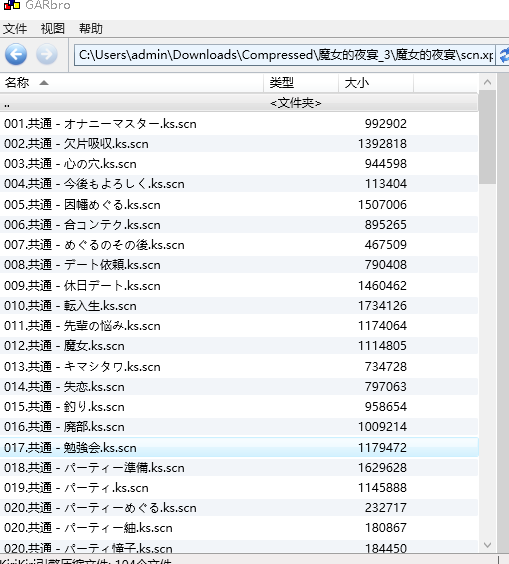
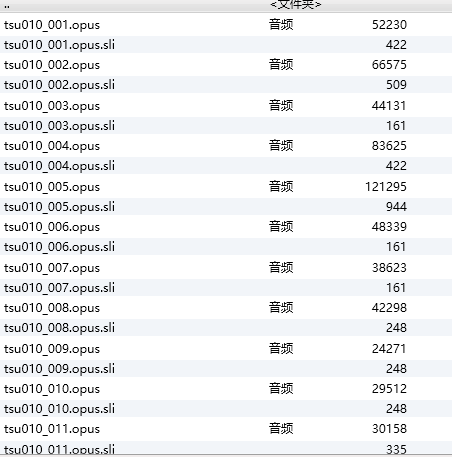
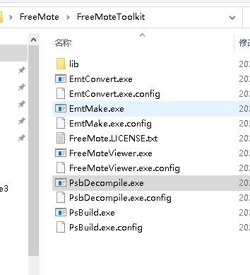

对绫地宁宁文本转语音的tacotron2模型适配复现记录

绫地宁宁是《魔女的夜宴》的角色，游戏引擎为krkr。复现所需要准备的材料如下：

1. 台词文本

2. WAV语音

这里用到了两个解包工具，GARbro和FreeMote。GARbro可以对xp3文件进行解包，FreeMote可以对PSB格式的文件进行解包。

PC版的《魔女的夜宴》的语音在voice.xp3中，对应的文本则在scn.xp3中

其中，**opus**是语音文件，通过转码软件可以转成WAV格式，格式工厂一个批次只能转1000个文件，故采用**ffmpeg**去自动大批量转码。基于python的包包括**ffmpy、pyAV**等非常难以安装和使用，最后采用shell命令

其中，因为模型要求，采用单声道，16bit，22050HZ转码

（可以采用os.system()嵌入python）

ks.scn文件是通过PCB格式加密的文件，通过FreeMote可以再解码，该软件在github上可以下载window版本的

把文件拖到PsbDecompile.exe,产生两个json文件

对里面提取台词和对应语音文件的名称，作者已经提供宁宁的台词对应文件，故此项暂时跳过

VScode可以支持ipynb文件的执行，需要安装相应的插件。但是截止2022.8。vscode无法在远程服务器支持IPython.display.audio。故把生成的ndarray结果保存成pickle文件，并放在本地jupyter执行，成功。
